# SewIt - compare and select the best nearby tailor for your order
* Native android application - Android with Java

<!-- Images -->
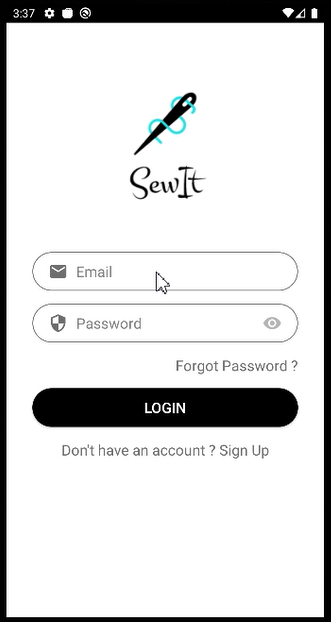 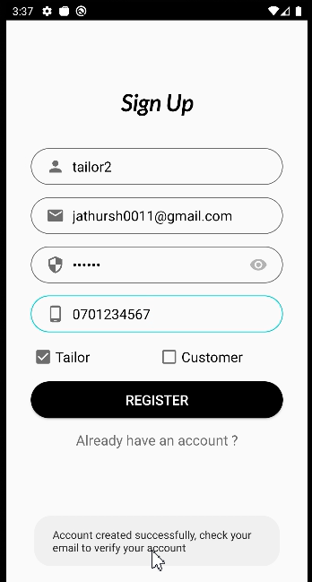 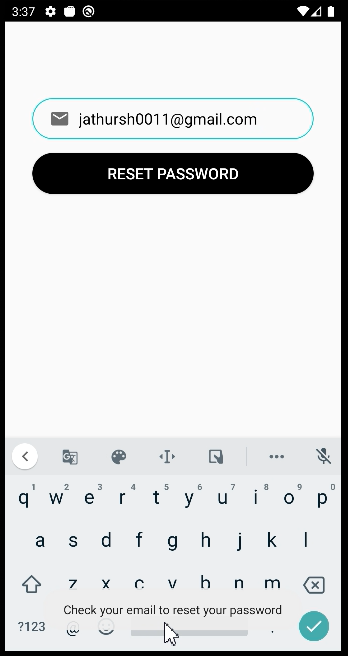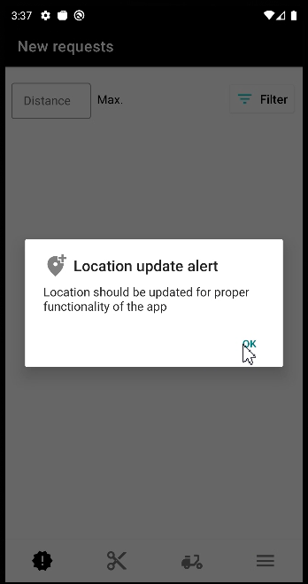
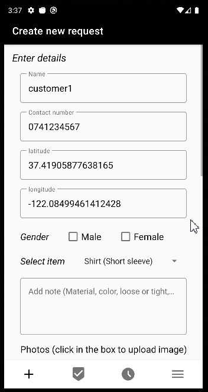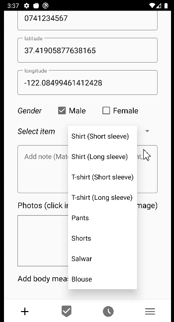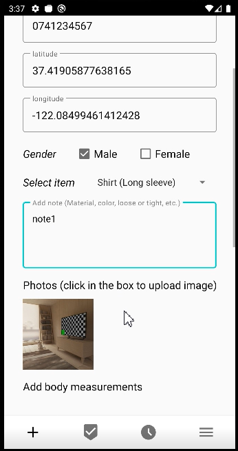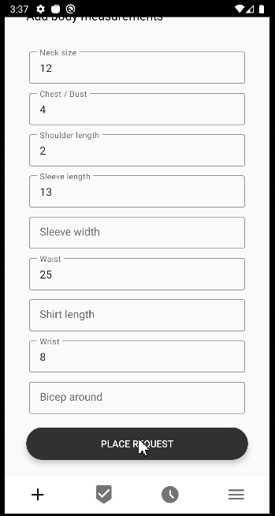
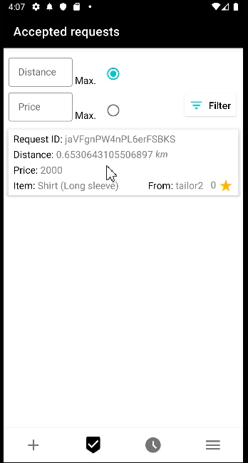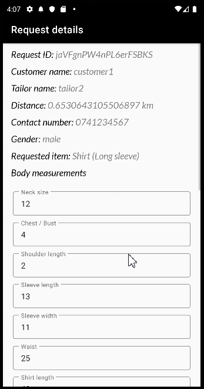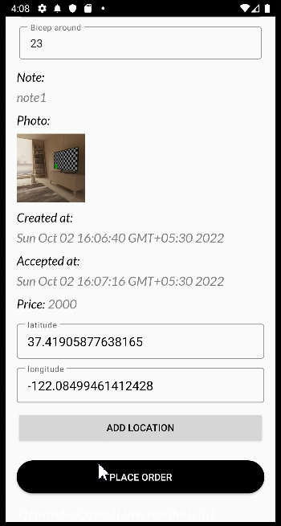
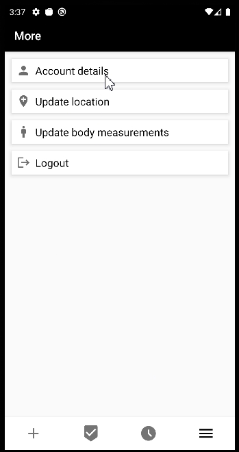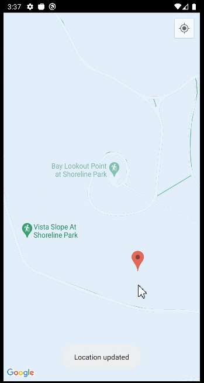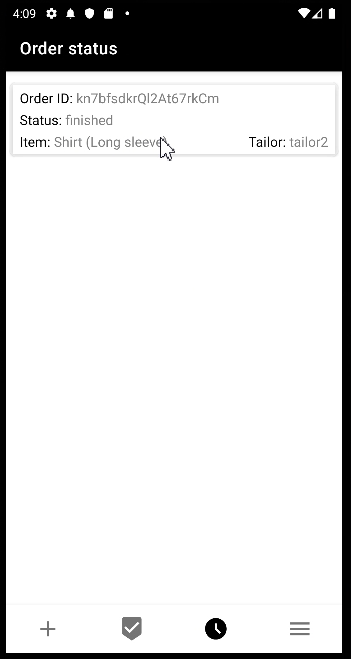
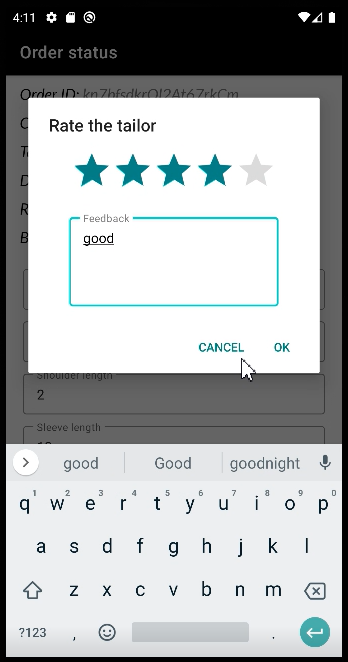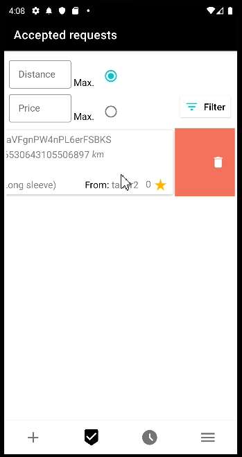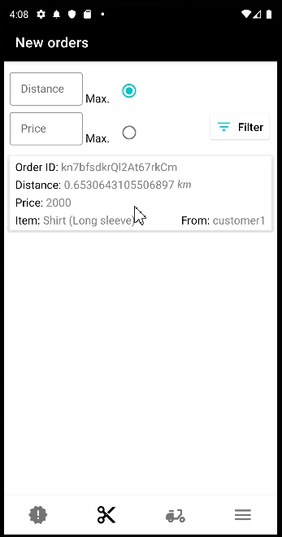
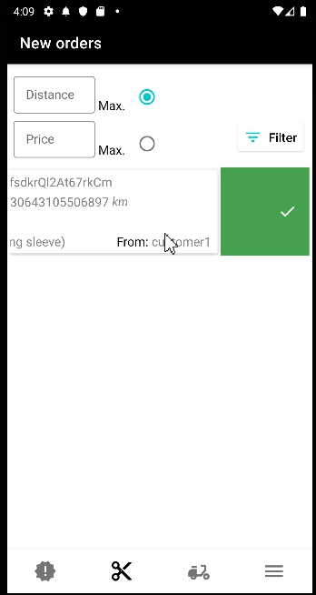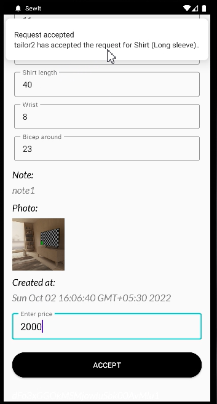
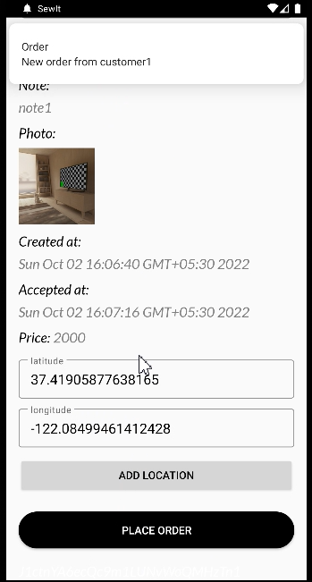

### Features
* 2 users - Tailors, Customers
* Customers can place orders to nearby tailors
* Users can update their locations
* Customers can save their body measurements and use it on future orders
* Tailors can send Notifications to Customer about orders status changes
* Customers can send Notifications to Tailor about requests, orders, etc.
* Customers can give rating and feedback to tailors

### To build this project, NEED
* Firebase: Authentication, Firetore, Storage, and Cloud messaging
* Google maps API key
  * add google_maps_api.xml file with the google maps api key
* local.properties file with your sdk location

### Future works
* automate the process - take the body measurements by captured image of a customer
* In-app messaging